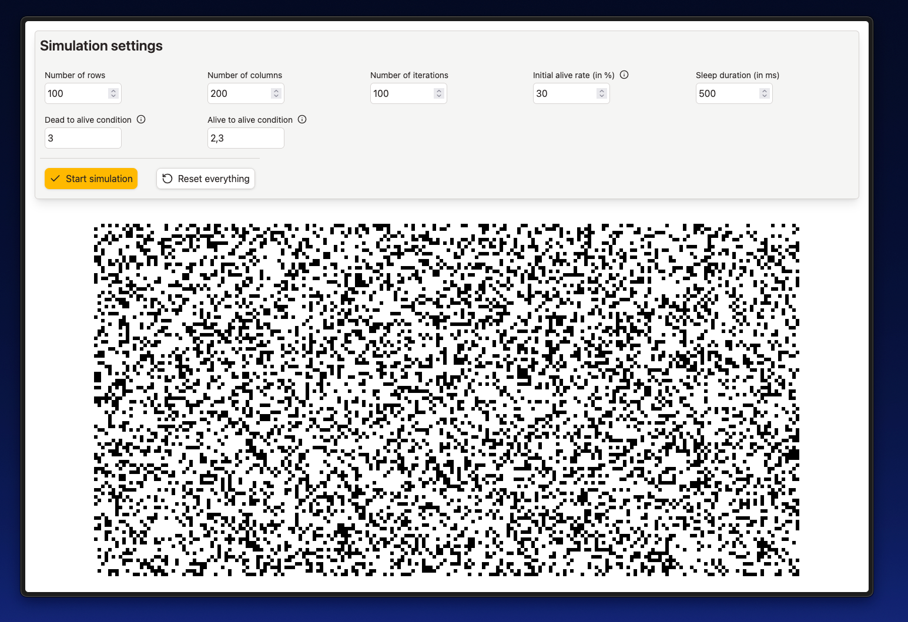

# 🧬 Lifelines

A visualization of Conway's Game of Life

## Technologies

- `React`
- `TypeScript`
- `Tailwind CSS`
- `Vite`

## Features

It is possible to customize the following settings through a UI:

- Number of rows / columns
- Number of iterations
- Initial alive rate (when the matrix is initialized, this is the rate of a single cell to be alive)
- sleep duration (time between redraws)
- dead to alive condition
- alive to alive condition

At each timestep, the number of living neighbours is calculated for each cell. If a cell is currently dead and the
number of living neighbours is contained in "dead to alive condition", the cell becomes alive. This works analogously for
living cells. The default values are the ones from Conwy's Game of Life, but changing these values might be of interest.

## Running the project

Clone the repository

```bash
git clone https://github.com/jonahkraft/lifelines.git
cd lifelines
```

Install dependencies and start the project. I use `npm` for this.

```bash
npm i         # install dependencies
npm run dev   # run the project
```

Open `http://localhost:5173` in your browser.

## Preview



## License

Distributed under the MIT License. See LICENSE file for more information. Do whatever you want with this project.